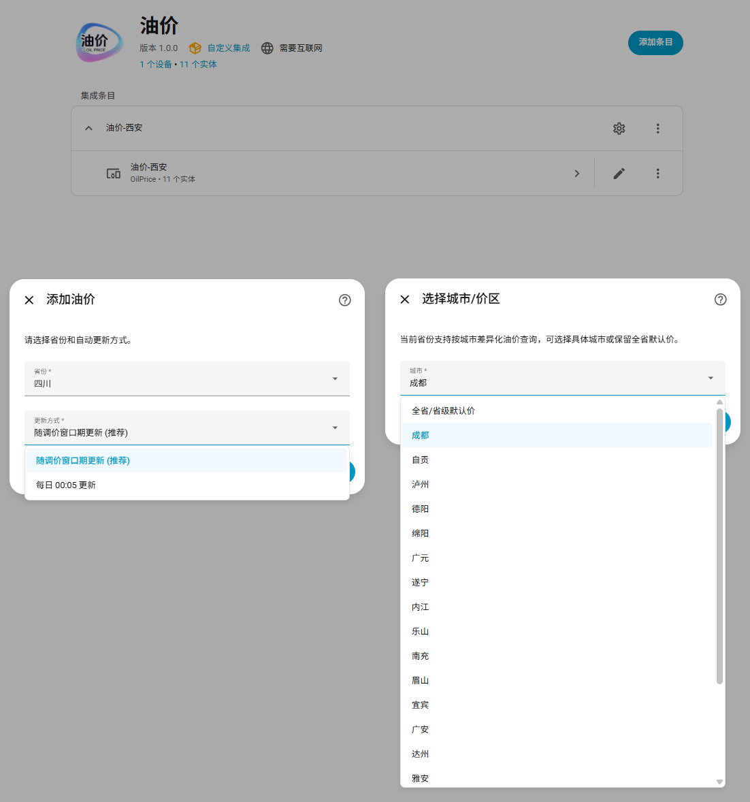
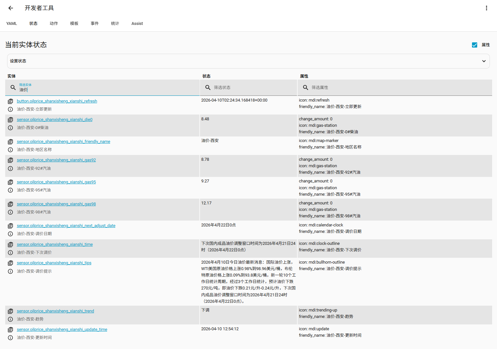
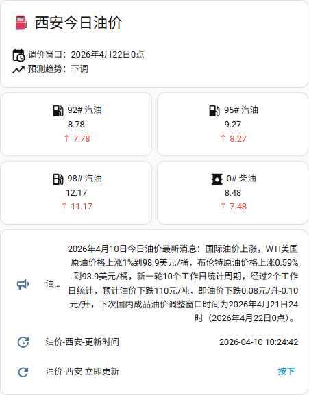
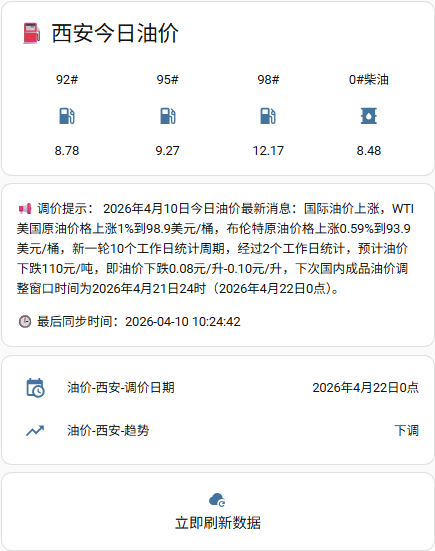
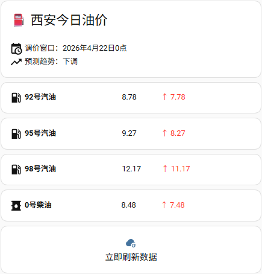
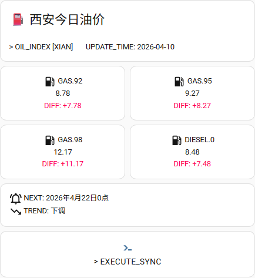
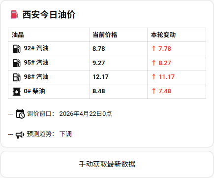
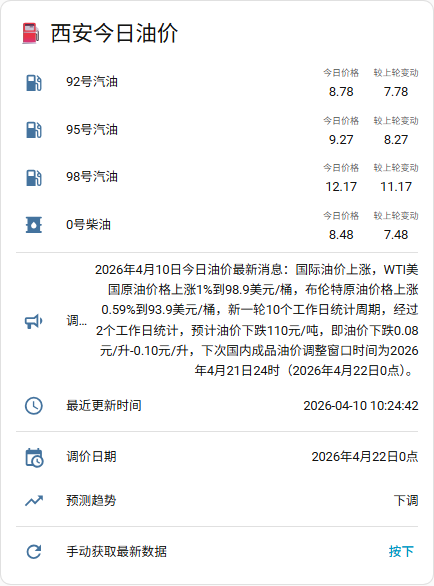

<a href="https://github.com/3899/OilPrice">
  
</a>

<div align="center">
  <br/>

  <div>
    <a href="./LICENSE">
      
    </a >
    <a href="https://github.com/3899/OilPrice/releases">
      
    </a >
    <a href="https://github.com/3899/OilPrice/releases">
        
    </a >
  </div>

  <br/>

  <picture>
    
  </picture>
  
</div>

# ⛽ OilPrice for Home Assistant

基于网页抓取的 Home Assistant 油价集成，支持省级与部分城市油价查询、窗口期调度、每日定时更新、手动刷新，以及“较上次变化金额”属性。

项目地址：[3899/OilPrice](https://github.com/3899/OilPrice)

## ✨ 功能概览

- 支持省份选择，部分省份支持第二步选择城市
- 城市页始终提供“全省/省级默认价”兜底
- 自动更新模式支持：
  - `随调价窗口期更新（推荐）`
  - `每日 00:05 更新`
- 每个地区自动创建多个独立实体，而不是单实体多属性
- 提供“立即更新”按钮
- 四个油价实体额外提供 `change_amount` 属性

## 📦 安装

### ⚡ HACS 快捷安装

[](https://my.home-assistant.io/redirect/hacs_repository/?owner=3899&repository=OilPrice&category=integration)

### 🛠️ 手动安装

1. [下载本项目](https://github.com/3899/OilPrice/releases/latest)
2. 将 `custom_components/oilprice` 复制到 Home Assistant 配置目录下的 `custom_components` 文件夹
3. 重启 Home Assistant

目录结构示意：

```text
config/
└─ custom_components/
   └─ oilprice/
```

## ⚙️ 配置指南

### ➕ 添加集成

1. 打开 Home Assistant
2. 进入 `设置 -> 设备与服务`
3. 点击 `添加集成`
4. 搜索 `油价` 或 `OilPrice`

### 1️⃣ 第一步：选择省份和更新方式

第一页固定显示两个选项：

- `省份`
- `更新方式`

第一页按钮显示为“下一步”。

如果你选择的是普通省份：

- 点击“下一步”后会直接完成配置

如果你选择的是支持城市的省份：

- 点击“下一步”后会进入第二页城市选择

### 2️⃣ 第二步：选择城市

只有部分省份会进入第二页。

第二页只显示一个字段：

- `城市`

可选项包括：

- `全省/省级默认价`
- 该省当前支持的城市

第二页按钮显示为“提交”。

## 🔄 更新方式说明

### 🕛 1. 随调价窗口期更新

行为：

- 集成会解析网页中的“下次调价时间”
- 到达窗口时间后顺延 5 分钟执行更新
- 如果未能解析出有效窗口时间，则自动回退到次日 `00:05`

适合：

- 只关心正式调价结果
- 希望减少无效抓取

### 📅 2. 每日 00:05 更新

行为：

- 按 `Asia/Shanghai` 时区，在每天 `00:05` 执行一次更新

适合：

- 不依赖窗口期解析
- 希望每天固定时间刷新

### 🧭 修改更新方式

1. 进入 `设置 -> 设备与服务`
2. 打开 `油价` 集成
3. 点击 `配置`
4. 重新选择更新方式并保存

## 🧩 实体说明

每个配置地区会创建：

- 10 个传感器实体
- 1 个按钮实体

### 📟 传感器实体

字段如下：

- `gas92`
- `gas95`
- `gas98`
- `die0`
- `time`
- `tips`
- `trend`
- `next_adjust_date`
- `update_time`
- `friendly_name`

### 🔘 按钮实体

- `refresh`

点击后会立即请求刷新。

### 🏷️ 实体命名规则

#### 🏙️ 省级实体

以北京为例：

- `sensor.oilprice_beijing_gas92`
- `sensor.oilprice_beijing_gas95`
- `sensor.oilprice_beijing_gas98`
- `sensor.oilprice_beijing_die0`
- `sensor.oilprice_beijing_time`
- `sensor.oilprice_beijing_tips`
- `sensor.oilprice_beijing_trend`
- `sensor.oilprice_beijing_next_adjust_date`
- `sensor.oilprice_beijing_update_time`
- `sensor.oilprice_beijing_friendly_name`
- `button.oilprice_beijing_refresh`

#### 🌆 城市实体

以四川成都为例：

- `sensor.oilprice_sichuan_chengdu_gas92`
- `sensor.oilprice_sichuan_chengdu_gas95`
- `sensor.oilprice_sichuan_chengdu_gas98`
- `sensor.oilprice_sichuan_chengdu_die0`
- `sensor.oilprice_sichuan_chengdu_time`
- `sensor.oilprice_sichuan_chengdu_tips`
- `sensor.oilprice_sichuan_chengdu_trend`
- `sensor.oilprice_sichuan_chengdu_next_adjust_date`
- `sensor.oilprice_sichuan_chengdu_update_time`
- `sensor.oilprice_sichuan_chengdu_friendly_name`
- `button.oilprice_sichuan_chengdu_refresh`

### 📈 `change_amount` 属性说明

该属性只存在于以下 4 个价格实体上：

- `gas92`
- `gas95`
- `gas98`
- `die0`

含义：

- 表示当前价格相较“上一次实际变价”的金额变化

行为规则：

- 首次抓取时默认为 `0.0`
- 如果本次价格与上次相同，则沿用之前保存的变化金额
- 如果本次价格与上次不同，则重新计算 `新价格 - 旧价格`
- 数据会持久化保存，Home Assistant 重启后仍可继续比较

模板示例：

```jinja2
{{ state_attr('sensor.oilprice_sichuan_chengdu_gas92', 'change_amount') }}
```


## 🖼️ 卡片与仪表盘使用

### 🗂️ 模板列表
项目中提供6份模板：

- [样式1_灵动网格.yaml](template/%E6%A0%B7%E5%BC%8F1_%E7%81%B5%E5%8A%A8%E7%BD%91%E6%A0%BC.yaml)
- [样式2_胶囊浮动药丸.yaml](template/%E6%A0%B7%E5%BC%8F2_%E8%83%B6%E5%9B%8A%E6%B5%AE%E5%8A%A8%E8%8D%AF%E4%B8%B8.yaml)
- [样式3_果味无边框极简.yaml](template/%E6%A0%B7%E5%BC%8F3_%E6%9E%9C%E5%91%B3%E6%97%A0%E8%BE%B9%E6%A1%86%E6%9E%81%E7%AE%80.yaml)
- [样式4_霓虹赛博朋克.yaml](template/%E6%A0%B7%E5%BC%8F4_%E9%9C%93%E8%99%B9%E8%B5%9B%E5%8D%9A%E6%9C%8B%E5%85%8B.yaml)
- [样式5_极简原生表格.yaml](template/%E6%A0%B7%E5%BC%8F5_%E6%9E%81%E7%AE%80%E5%8E%9F%E7%94%9F%E8%A1%A8%E6%A0%BC.yaml)
- [样式6_标准原生横向列表.yaml](template/%E6%A0%B7%E5%BC%8F6_%E6%A0%87%E5%87%86%E5%8E%9F%E7%94%9F%E6%A8%AA%E5%90%91%E5%88%97%E8%A1%A8.yaml)


### 📘 使用指南

#### 1️⃣ 步骤1：添加卡片到仪表板

1. 打开你的 Home Assistant 概览面板（Dashboard）。
2. 点击右上角的 “编辑仪表板” (铅笔图标)。
3. 在你想要添加的视图中，点击右下角的 “添加卡片”。
4. 在弹出的卡片列表中，一直拉到最底部，选择 “手动” (Manual)。
5. 将上方你心仪风格的 YAML 代码全选复制，粘贴到左侧的代码输入框中即可。

#### 2️⃣ 步骤2：实体替换说明

本模板中的代码以 `西安`（oilprice_shanxisheng_xianshi_*）为例。如果您要为其他城市配置，需批量替换代码中的实体 ID：
- 例如，如果要配置四川成都，将代码中的 oilprice_shanxisheng_xianshi 全部替换为 oilprice_sichuan_chengdu。
- 替换后，记得将文本中的“西安”修改为您所在的城市名称。

##### 🧭 实体查看方法1：通过“集成”页面查看（最直观，推荐）
这是最准确的路径，可以直接看到特定配置项下挂载的所有实体：
1. 在左侧菜单栏点击 `配置 (Settings)`。
2. 选择 `设备与服务 (Devices & Services)`。
3. 在 `集成 (Integrations)` 选项卡下，找到名为 “油价-[你的地区]” 的卡片（例如：油价-西安）。
4. 点击卡片上的 “11 个实体 (11 entities)” 链接。
5. 在弹出的列表中，点击任意一个你需要的实体，进入详情页后，点击右上角的齿轮图标即可查看和复制完整的实体 ID (Entity ID)。

##### 🔎 实体查看方法2：通过“开发者工具”筛选（最适合批量复制）

当你需要在编写 YAML 卡片时快速查找和比对数据时，这个方法最高效：
1. 在左侧菜单栏点击 `开发者工具 (Developer Tools)`。
2. 顶部选择 `状态 (States)` 选项卡。
3. 在 `实体 (Entity)` 的过滤搜索框中输入关键字。
- 搜索建议：输入你配置的地区名称（如 `四川`），系统会自动列出相关的传感器及其当前的值和属性（如 change_amount）。

##### 📚 实体查看方法3：通过“实体”注册表全局搜索
1. 在左侧菜单栏点击 `配置 (Settings)` -> `设备与服务 (Devices & Services)`。
2. 顶部选择 `实体 (Entities)` 选项卡。
3. 在右上角的搜索框中直接输入地区名称（如 `四川`），即可列出该地区对应的所有油价实体，第一列即为完整的实体 ID。

#### 🔌 关于依赖

- `样式6_标准原生横向列表.yaml`依赖了 multiple-entity-row 插件。如果使用该款后显示“配置错误”，说明您的系统并未安装此插件。请前往 HACS 商店，搜索 multiple-entity-row 安装并刷新浏览器后即可恢复正常。
- 其他 5 款均完全由 markdown 和 button 构建，开箱即用，零依赖。

### 🎨 模板预览

#### 🟦 样式1 灵动网格

模板文件：[样式1_灵动网格.yaml](template/%E6%A0%B7%E5%BC%8F1_%E7%81%B5%E5%8A%A8%E7%BD%91%E6%A0%BC.yaml)

预览图：



说明：

现代感最强的一套方案。以 Home Assistant 原生 `grid` 双列布局为骨架，将四种油品拆分为独立卡片，并用半透明胶囊块承载涨跌金额，整体观感轻盈、模块化，适合大多数亮色或中性色主题。

#### 💊 样式2 胶囊浮动药丸

模板文件：[样式2_胶囊浮动药丸.yaml](template/%E6%A0%B7%E5%BC%8F2_%E8%83%B6%E5%9B%8A%E6%B5%AE%E5%8A%A8%E8%8D%AF%E4%B8%B8.yaml)

预览图：



说明：

这套样式优先追求紧凑和效率。通过 4 列 `grid` 将每个油品压缩成横向圆角“药丸”，在极小的垂直空间里保留价格与变动信息，非常适合作为手机端 Dashboard 顶部的速览入口。

#### 🍏 样式3 果味无边框极简

模板文件：[样式3_果味无边框极简.yaml](template/%E6%A0%B7%E5%BC%8F3_%E6%9E%9C%E5%91%B3%E6%97%A0%E8%BE%B9%E6%A1%86%E6%9E%81%E7%AE%80.yaml)

预览图：



说明：

偏向 iOS Home 风格的柔和路线。整个布局去掉了明显边框和生硬分割，依靠大圆角、低饱和背景色块和带阴影的圆形图标底座建立层次，观感更温和，也更适合家居面板场景。

#### 🌃 样式4 霓虹赛博朋克

模板文件：[样式4_霓虹赛博朋克.yaml](template/%E6%A0%B7%E5%BC%8F4_%E9%9C%93%E8%99%B9%E8%B5%9B%E5%8D%9A%E6%9C%8B%E5%85%8B.yaml)

预览图：



说明：

面向深色主题和极客风格。通过黑底、发光文字、霓虹图标和偏终端化的排版语气，营造出明显的赛博朋克气质。如果你的仪表盘本身就是深色高对比路线，这一套会很有存在感。

#### 📋 样式5 极简原生表格

模板文件：[样式5_极简原生表格.yaml](template/%E6%A0%B7%E5%BC%8F5_%E6%9E%81%E7%AE%80%E5%8E%9F%E7%94%9F%E8%A1%A8%E6%A0%BC.yaml)

预览图：



说明：

最偏实用主义的一套方案。保留了 Markdown 表格天然的信息密度，通过 Jinja2 变量在最紧凑的空间里实现价格与涨跌的动态变色，适合重视数据清晰度、并希望尽量减少装饰元素的用户。

#### 📑 样式6 标准原生横向列表

模板文件：[样式6_标准原生横向列表.yaml](template/%E6%A0%B7%E5%BC%8F6_%E6%A0%87%E5%87%86%E5%8E%9F%E7%94%9F%E6%A8%AA%E5%90%91%E5%88%97%E8%A1%A8.yaml)

预览图：



说明：

最贴近 Home Assistant 原生实体列表的使用习惯。它依赖 HACS 插件 `multiple-entity-row`，可以把“较上轮变动金额”直接挂在主价格旁边，适合偏向标准化、维护成本低、并希望与原生 UI 融合更自然的用户。

额外依赖：

- `multiple-entity-row`


## 🚀 版本更新记录

### 📌 v1.0.1

本次版本为底层质量升级，重点优化油价实体稳定性、刷新可靠性及 Home Assistant 兼容性。
- 🏷️ 油价实体标准化
	- 92#/95#/98#/0# 油价格实体升级为标准数值型传感器，新增 `元/升` 单位，适配 Home Assistant 数值计算、排序与仪表盘展示，同时保留 `change_amount` 属性，不影响原有使用习惯。
- 🔄 自动刷新更稳定
	- 优化单次刷新失败后永久停更问题，遇网络或源站异常仍会自动执行下一次刷新，保障更新不中断。
- ✅ 数据校验更严格
	- 仅成功解析出真实油价时才视为有效更新，避免空页面覆盖原有有效油价数据。
- 🆔 实体身份更稳定
	- 优化地区实体唯一标识规则，同一地区删除后重新添加，可沿用原有实体身份，减少重复生成新实体。
- 📊 兼容原有显示习惯
	- 新增油价单位不影响现有概览面板数字显示样式，仅优化实体语义与兼容性。

### 📌 v1.0.0

- 支持省份选择，部分省份支持第二步选择城市
- 城市页始终提供“全省/省级默认价”兜底
- 自动更新模式支持：
  - `随调价窗口期更新（推荐）`
  - `每日 00:05 更新`
- 每个地区自动创建多个独立实体，而不是单实体多属性
- 提供“立即更新”按钮
- 四个油价实体额外提供 `change_amount` 属性


## 🧯 故障排查

### 1️⃣ 添加集成时报“无法连接”

可能原因：

- Home Assistant 当前无法访问源站
- 源站暂时不可用
- 网络环境阻止了 HTTP 请求

### 2️⃣ 选择某个城市后没有数据

可能原因：

- 页面暂时没有目标油价数据

建议：

- 先改成“全省/省级默认价”验证

### 3️⃣ `change_amount` 为空或为 0

这是正常情况，常见原因：

- 首次抓取没有历史数据
- 当前价格和上一次抓取价格相同

## 🎖️ 鸣谢

> 本项目基于开源项目 `oilprice-for-homeassistant` 进行深度重构，并在此之上完成二次开发与功能拓展，谨向原作者及开源社区致以诚挚谢意。
